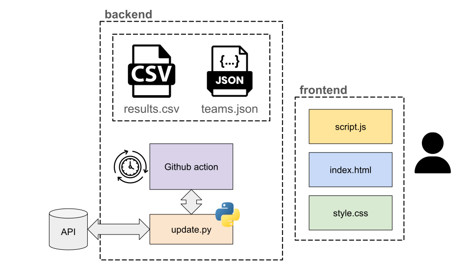

# 🏐 VolleyBatch

**VolleyBatch** is a web platform that provides **updated ELO-like rankings** for all volleyball teams.  
---

## 🚀 Version 1.0

The current version (**v1.0**) focuses on **Italian volleyball teams**, providing up-to-date rankings based on match results.  
Future releases will extend support to **international leagues** and include advanced features such as player-level statistics and predictive modeling.

---

## 🧠 Project Overview

VolleyBatch automatically processes volleyball match data and computes rankings using an **ELO-inspired algorithm**.  
This allows for a fair comparison between teams of different levels, considering both recent form and opponent strength.

The main components of the system are:
- **Data Ingestion** – Collects and validates official match results.
- **Ranking Engine** – Computes ELO-like scores for each team.
- **Web Dashboard** – Displays rankings and stats in a user-friendly interface.
- **Batch Processing** – Periodically updates all rankings to keep them current.

## ⚙️ Data Ingestion Script

VolleyBatch includes a **Python script** (`update_results.py`) that retrieves the latest volleyball match and updates `results.csv`.

### Example CSV Structure
### Example CSV Structure
match_id | date | league | team1 | team2 | team1_sets | team2_sets | team1_set1 | team2_set1 | team1_set2 | team2_set2 | team1_set3 | team2_set3 | team1_set4 | team2_set4 | team1_set5 | team2_set5 | winner |
|------|---------|---------|--------|--------|-------------|-------------|-------------|-------------|-------------|-------------|-------------|-------------|-------------|-------------|-------------|-------------|---------|
|1240| 2025-10-28 | Serie A | Modena | Perugia | 3 | 1 | 25 | 20 | 23 | 25 | 25 | 22 | 25 | 18 | 0 | 0 | Modena |

---

## 🏗️ Architecture

The architecture of VolleyBatch is illustrated below:  

---

## 👥 Contributors

VolleyBatch is developed and maintained by:
- **Giovanni Valer**  
- **Stefano Genetti**  
- **David Svaldi**

---

## 🪪 License

This project is licensed under the [MIT License](LICENSE).

---
